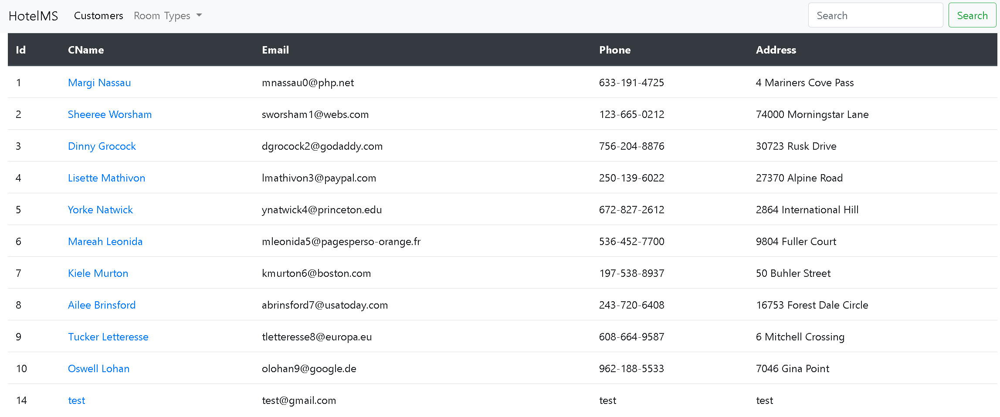
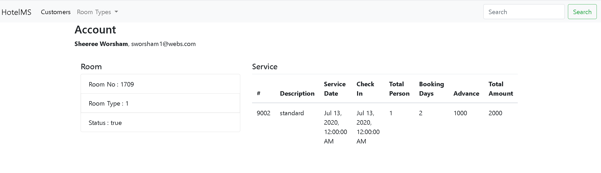
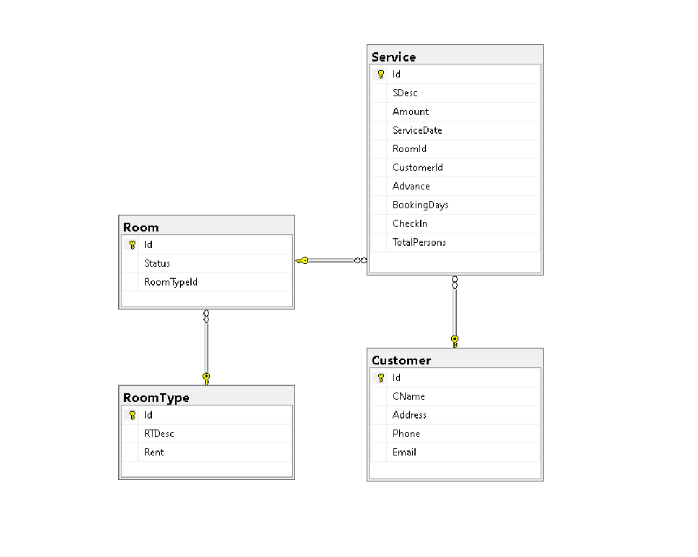
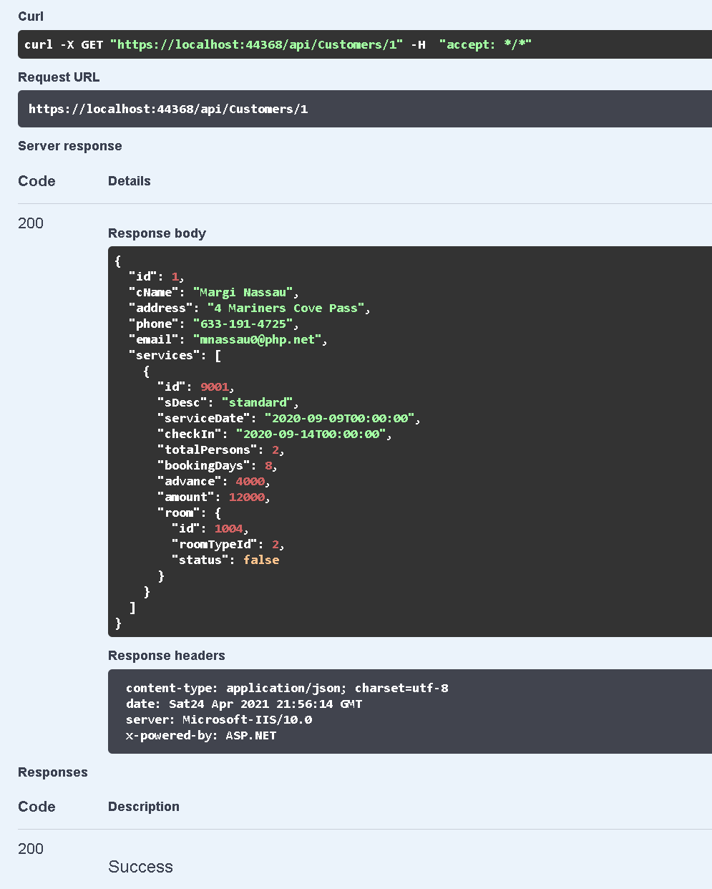
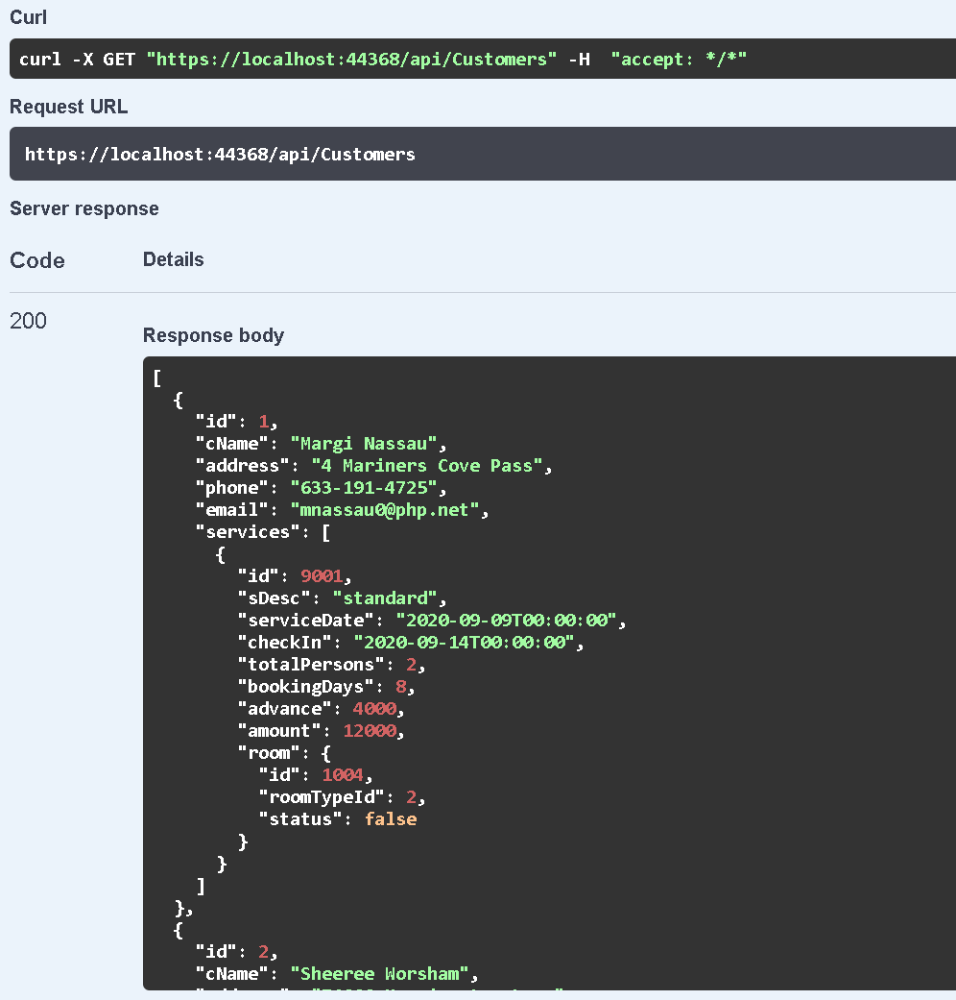
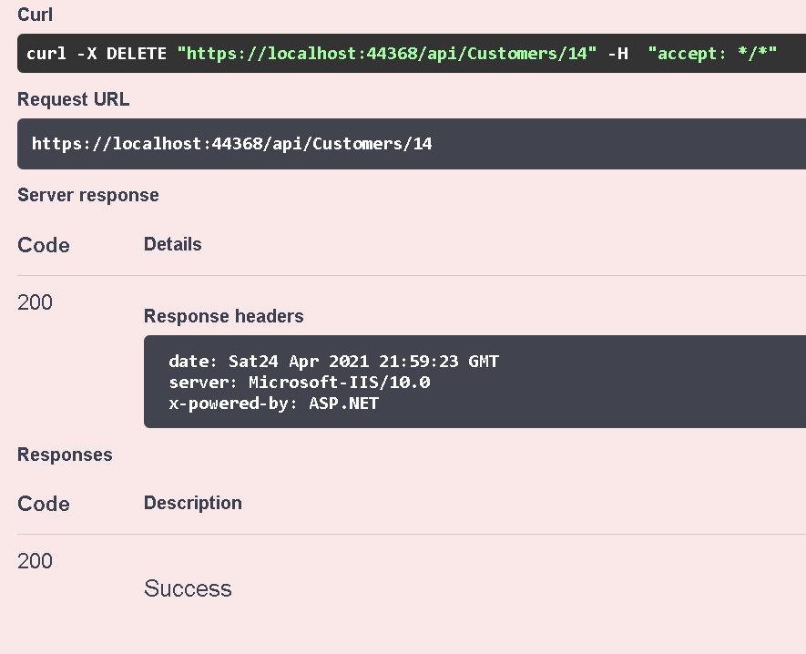
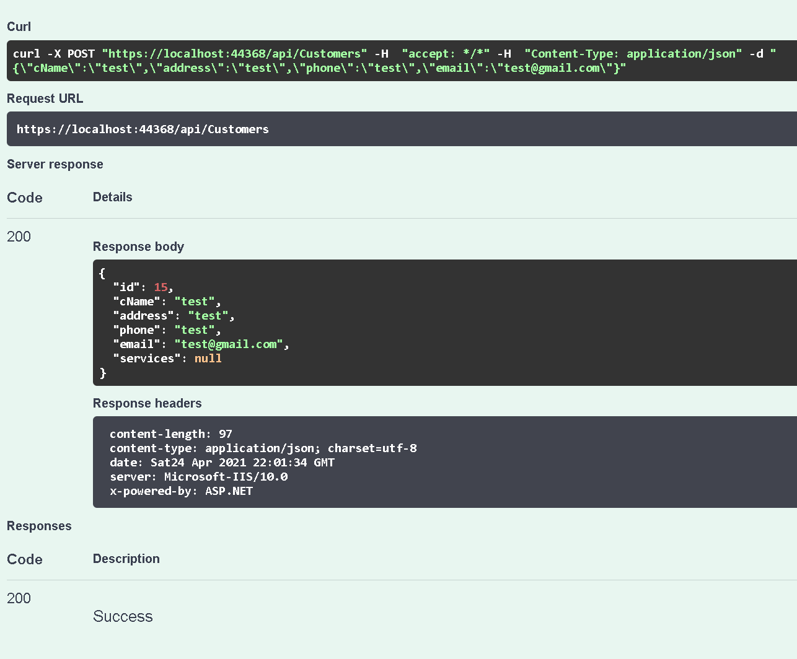
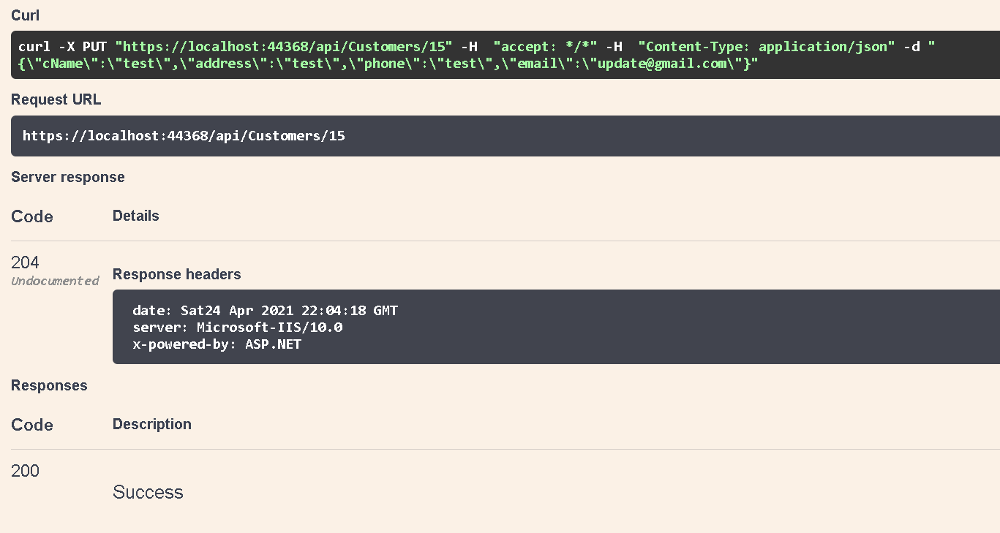
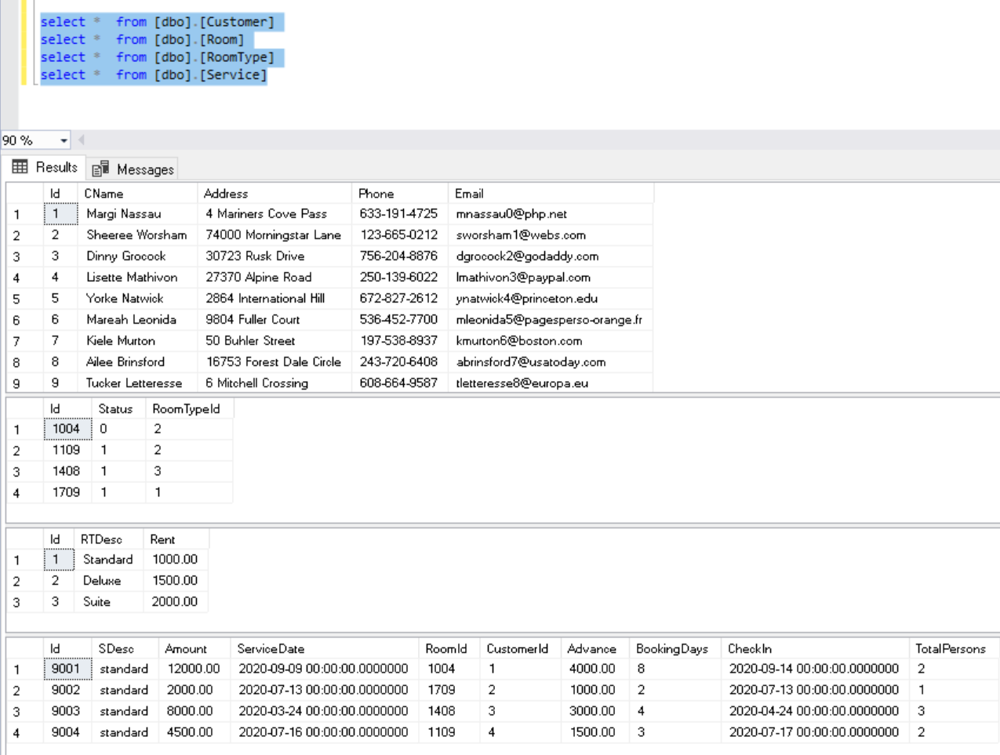

# HotelMS

HotelMS is an Angular-based ASP.NET Core application.

#### Customers Dashboard

#### Customer Detail

Including Room and Service

#### Database Schema

### CRUD APIs

**GET**/api/Customers/{id}

**DELETE**/api/Customers/{id}

**PUT**/api/Customers/{id}

**GET**/api/Customers

**POST**/api/Customers

**GET**/api/Rooms/{id}

**DELETE**/api/Rooms/{id}

**PUT**/api/Rooms/{id}

**GET**/api/Rooms

**POST**/api/Rooms

...

### Test

All endpoints have been tested. Here are some samples.

Get Customer By Id

Get All Customers

Delete Customer By Id

Create Customer

Update Customer

### Test Data

